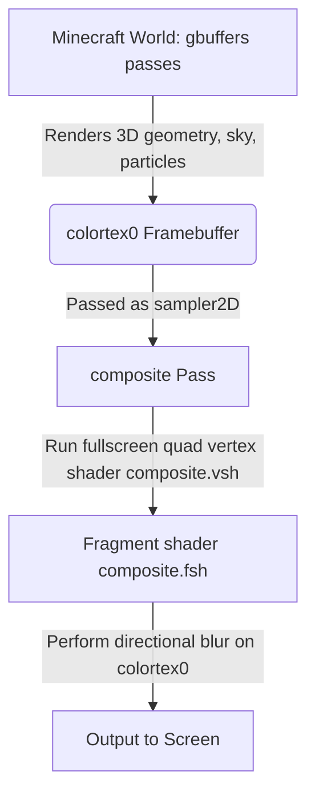

# Developer Notes & Shader Pipeline Guide

Welcome to the development notes for the **Basic Motion Blur** learning shader pack. This document explains how the shader works under the hood and provides a detailed roadmap for expanding it into a production-ready cinematic motion blur.

---

## The Screen-Space Shader Pipeline

In modern game engines like Minecraft Java (with Iris or OptiFine), rendering is split into multiple passes. This shader pack uses the simplest post-processing structure: the **composite pass**.

### 1. The Fullscreen Quad Flow
During the `gbuffers` stage, Minecraft renders the world, entities, and particles. The result is stored in color framebuffers (primarily `colortex0` for standard colors).

Once the 3D rendering is finished, Minecraft switches to post-processing:
1. It draws a single flat rectangle (a fullscreen quad) covering the entire screen.
2. It runs `composite.vsh` to map the corners of this quad to normalized device coordinates (clip space) and pass texture coordinates to the fragment shader.
3. It runs `composite.fsh` for every pixel on the screen. The texture coordinate (`texcoord`) maps exactly to the screen location from `(0,0)` to `(1,1)`.

### 2. Why is this the Easiest Starting Point?
By using the composite pass, we do not need to modify how blocks or entities look individually. We simply take the completed picture of the game (`colortex0`), apply a mathematical filter (directional blur) centered around each pixel, and output the modified image. This isolates the shader logic from Minecraft's complex rendering engine, making it an ideal environment for learning GLSL.

---

## Roadmap for Later Upgrades

This project is designed to be a learning foundation. Here is how you can evolve it from a static screen-space blur into a realistic, dynamic motion blur:

### Phase 1: Camera-Based Fake Motion Blur
*   **Concept**: Blur the screen based on how fast the player is rotating the camera (pitch and yaw speed).
*   **Implementation**:
    1.  Read the frame-to-frame change in camera angles using Iris's uniforms (e.g., `cameraPosition`, `previousCameraPosition`, or tracking yaw/pitch changes manually via scripts/uniforms).
    2.  Calculate the angular velocity of the camera.
    3.  Set the `BLUR_DIRECTION` dynamically to match the direction of camera movement.
    4.  Scale the `BLUR_STRENGTH` based on the rotation speed (no rotation = no blur).

### Phase 2: Velocity-Aware (True) Motion Blur
*   **Concept**: Blur pixels individually based on how fast that specific pixel's world coordinate is moving relative to the screen. This handles both camera translation/rotation and moving entities.
*   **Implementation**:
    1.  Enable depth buffer reading by declaring `uniform sampler2D depthtex0;` to get the depth of each pixel.
    2.  Reconstruct the world position of the current pixel using the depth and the inverse projection-view matrix (`gbufferProjectionInverse` and `gbufferModelViewInverse`).
    3.  Project the previous frame's position of that same world point using the previous frame's projection-view matrix (`previousProjection` and `previousModelView`).
    4.  Calculate the difference between the current screen position and the previous screen position. This difference vector is the **velocity vector** for that pixel.
    5.  Sample along this velocity vector in the fragment shader.

### Phase 3: Better Sampling & Noise
*   **Concept**: Avoid the "ghosting" artifacts that occur when `BLUR_SAMPLES` is low, and improve performance.
*   **Implementation**:
    1.  **Dithering / Jittering**: Add a pseudo-random noise offset (using a blue noise texture or a screen-space hash function) to each sample position. This turns distinct ghosting bands into soft, film-like grain.
    2.  **Gaussian Weights**: Instead of averaging samples equally (box filter), weight the center samples higher using a Gaussian distribution function to produce a smoother blur.
